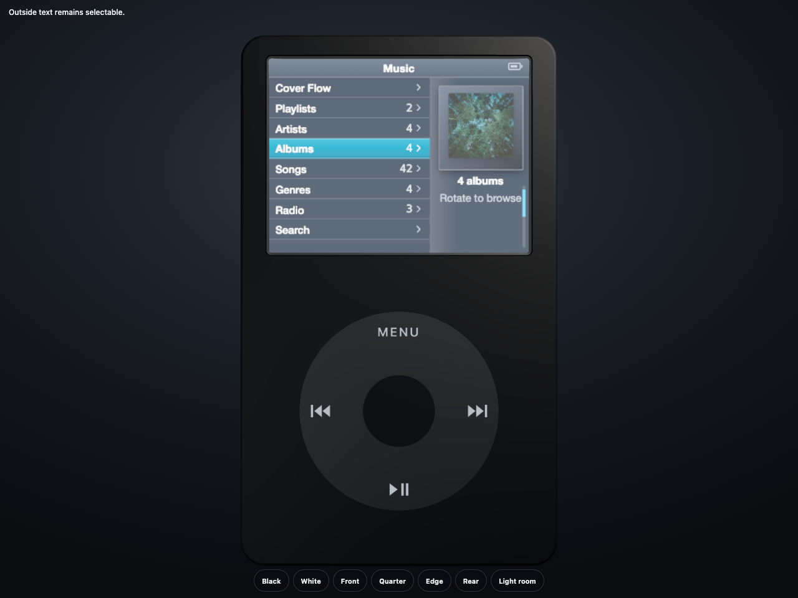
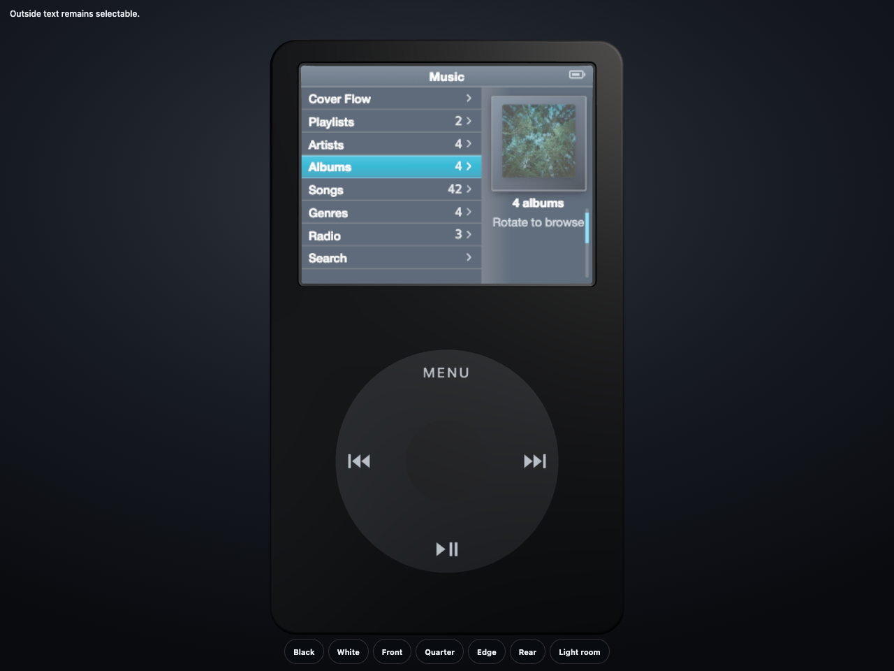
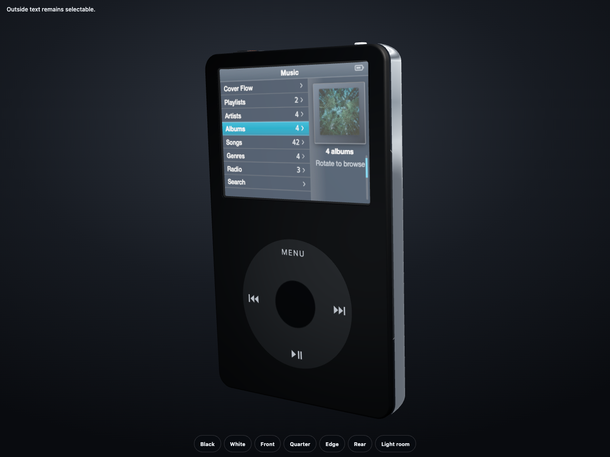
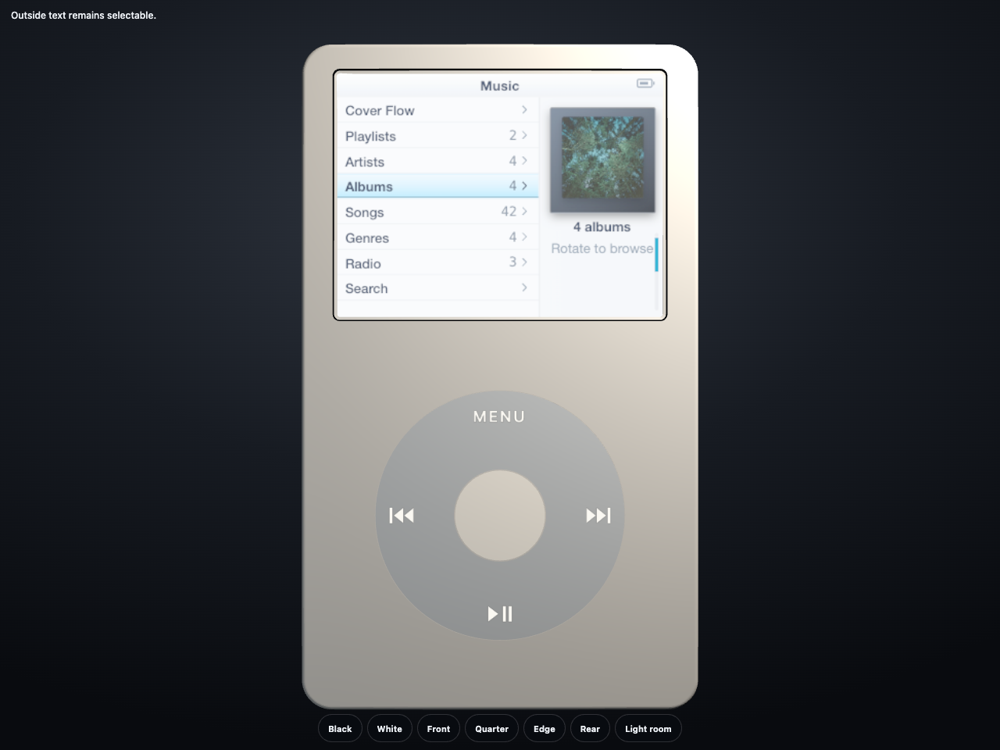
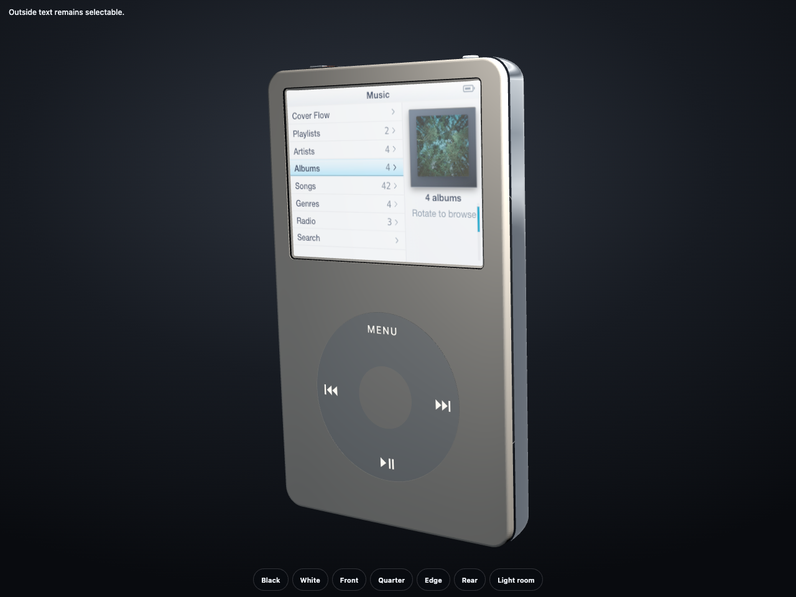

# Screen reveal and Select press correction

## Result

The production `/_spike/device` route now presents the LCD as an active panel
inside a restrained, flat black assembly reveal. The glossy polycarbonate face
retains its outer roll, but the display opening no longer inherits Three's
automatic hole bevel. The cover sheet is planar, so it cannot render a raised
reflective perimeter at a quarter view.

Select remains a separate matte-plastic part at rest. A real pointer hold moves
the existing mesh only along device-local Z by 0.12 mm. Its material,
geometry, normals, X/Y position, quaternion and scale are invariant. Release
returns the exact rest transform.

## Reference basis

The correction was checked against the owner's `IMG_2239`, `IMG_2240`,
`IMG_2242`, `IMG_2243`, `IMG_2248` and `IMG_2249` photographs. Those views show
the front opening, Select, front/quarter projection and enclosure profile. The
following external references were also inspected rather than relying on
model recall:

- Apple, *Identify your iPod model*: https://support.apple.com/en-ae/103823
- iFixit, *iPod 5th Generation (Video) Front Panel Replacement*:
  https://www.ifixit.com/Guide/iPod%2B5th%2BGeneration%2B%28Video%29%2BFront%2BPanel%2BReplacement/610
- iFixit, *iPod 5th Generation (Video) Front Faceplate Replacement*:
  https://www.ifixit.com/Guide/iPod%2B5th%2BGeneration%2B%28Video%29%2BFront%2BFaceplate%2BReplacement/159192

No missing real-world angle remained for these two bounded corrections. Rear
geometry was outside their scope and was not inferred from the front views.

## Structural proof

`packages/device/src/screen-aperture.test.ts` builds the exact production
front extrusion. Before correction, the control geometry contains more than
3 px of rejected inward slope. After correction, every candidate vertex lies
on the original rounded-rectangle aperture and more than 100 wall triangles
have zero forward-facing normal component. The same test locks the planar
cover sheet, full-depth unlit black reveal and absence of physical-lighting
props on both reveal layers.

`packages/device/src/control-physics.test.ts` binds the production Select mesh
with a real physical material. It proves:

- rest X/Y, quaternion and scale do not change;
- held Z is exactly rest Z minus the 0.12 mm model conversion;
- geometry positions and normals are byte-identical;
- the same material object and serialization survive held and released states;
- reduced-motion and timed release restore the exact rest transform; and
- production physics contains no material, colour, opacity, emissive or shader
  path for Select.

## Mutation controls

All plants were applied locally, observed red, and reverted before the source
commits:

| Plant | Focused result |
|---|---|
| Leave aperture vertices at their generated bevel positions | 1 fail; first observed boundary error `0.906961` against `< 0.00001` |
| Restore the rejected 0.36 mm Select travel | 1 fail; expected `0.12`, received `0.36` |
| Add lateral X travel to the Select press | 1 fail; expected rest X `4.5`, received `5.140776699029126` |
| Leave `0.001` model unit of release drift | 1 fail; expected rest Z `3.75`, received `3.749` |

After restoration, the combined focused suite reported 13 pass, 0 fail and
10,931 assertions.

## Immutable browser evidence

The browser producer is
`apps/web/tests/screen-select-evidence.e2e.ts`. It served an archive of the
committed source rather than the dirty shared checkout.

- Reviewed commit: `16cbf4a2705417f19c375b97b6819eb13f4d777e`
- Reviewed tree: `c487ae746f64cfa6c5f464d0b6faa174db2f7860`
- Source fingerprint:
  `923e404d95d02554d6678c65b6b6224a1f34373f2f5497061a7fc40ba4b3f21f`
- Fingerprinted files: 197
- Health endpoint: expected and current fingerprints equal
- Browser: Chrome with `CanvasDrawElement` enabled, real T1 DOM composite
- Result: 1 pass

The producer used the ordinary physical pointer path: move to Select, pointer
down, hold, pointer up, and the 96 ms demand-driven release. It exposed no
synthetic pose API or control query parameter. All four held hashes differ
from rest, while every released hash is byte-identical to its matching rest
hash.

| Finish | Front rest | Front held | Quarter rest | Quarter held |
|---|---|---|---|---|
| Black |  |  |  |  |
| White |  |  |  |  |

The complete 12-image manifest, hashes, release pairs and provenance are in
[`summary.json`](screen-select-correction/summary.json).

## Final verification

- `bun test packages/device/src`: 186 pass, 0 fail
- `bun run typecheck`: 11/11 projects clean
- `bun run lint`: clean
- `bun run gates`: 16 automated pass, 0 automated fail; standing manual U14
  and U15 remain manual
- `bun test`: 1,107 pass, 0 fail
- `bun run --cwd apps/web build`: client and SSR builds complete; existing
  chunk-size advisory only

The shared checkout still contains unrelated owner/other-lane modifications.
They were not staged, committed, reset or edited by this correction.
